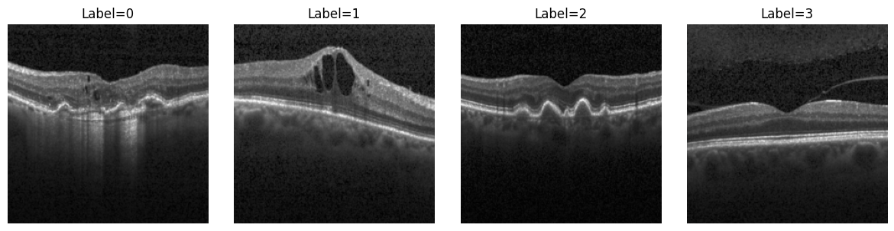
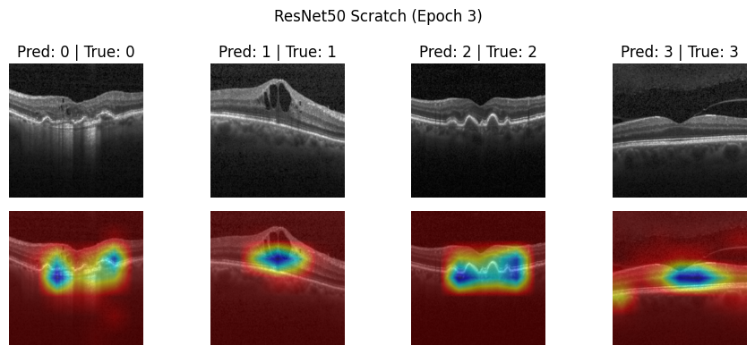

# Vision on OCT2017

*Exploring Vision Transformers (ViT), ResNet, and Grad-CAM for retinal OCT classification and interpretability.*

This project started as a curiosity:  
> *How do I know what my Vision model is looking at the right thing and not just the corner of a screen?*

Using the [**OCT2017 retinal dataset**](https://data.mendeley.com/datasets/rscbjbr9sj/2), I trained and visualized different vision architectures to better understand what they "see" during classification. While performance benchmarking was not the focus, the main goal was **interpretability**: comparing how ResNet and ViT attend to retinal structures, and how methods like **Grad-CAM** can help us peek into a model’s reasoning.

👉 For full rambling check out [`docs/vision.ipynb`](docs/vision.ipynb) 👈

## Highlights
- Implemented **ResNet50 (from scratch + fine-tuned)** and **Vision Transformer (from scratch)**  
- Visualized model attention with **Grad-CAM**  
- Observed:
  - **ResNet** heatmaps localized to retinal interfaces (clinically meaningful regions) similar to dataset author's results [authors](https://www.cell.com/cell/fulltext/S0092-8674(18)30154-5).  
  - **ViT** showed more global activation which ocassionally diffuse but tends to still overlap with key retinal interface.  

**Takeway:**
> *What began as a curiosity about what my model is looking at has evolved into deeper questions: how can we design interpretable and trustworthy vision architectures that are not only accurate? This is the question I hope to carry forward into graduate research, building on methods like Grad-CAM and attention visualization while exploring new approaches to explainability in biomedical imaging.*

## Visualizations
Some fun images from the notebook:

### 1. OCT Batch

  

<em>Figure 1: Example OCT image batch after preprocessing with labels corresponding to disease: 0 (CNV), 1 (DME), 2 (DRUSEN), 3 (NORMAL).</em>

### 2. Patchified Image

  

<em>Figure 2: Patchified representation of an OCT image for the Vision Transformer.</em>

### 3. Patchified Image

#### ResNet50 (From Scratch)

  

<em>Figure 3: Grad-CAM from ResNet50 trained from scratch, showing attention on retinal interfaces.</em>

#### ResNet50 (Fine-tuned)

  

<em>Fig 4. Grad-CAM from fine-tuned ResNet50, with stronger localization of retinal features.</em>

#### ViT (From Scratch)

  

<em>Grad-CAM visualization from the Vision Transformer, showing broader/global activation patterns.</em>

## Future Work
Some stuff I noticed which I would like to explore more:
- Evaluate model accuracy and explore hyperparameter tuning  
- Investigate overfitting risks in OCT datasets
- Explore other interpretability techniques for Vision Transformers:
  - [LeGrad](https://walidbousselham.com/LeGrad/)  
  - [ViT-ReciproCAM](https://arxiv.org/pdf/2310.02588)  
- Compare across different biomedical imaging modalities  

## Cited Resources
- [Deep Learning Tutorials – Phillip Lippe @ UvA](https://uvadlc-notebooks.readthedocs.io/en/latest/index.html)  
- [Attention Is All You Need (Vaswani et al., 2017)](https://arxiv.org/abs/1706.03762)  
- [An Image Is Worth 16x16 Words (Dosovitskiy et al., 2020)](https://arxiv.org/abs/2010.11929)  
- [Grad-CAM (Selvaraju et al., 2017)](https://arxiv.org/abs/1610.02391)  
- [OCT2017 retinal dataset (Kermany et. al., 2018)](https://data.mendeley.com/datasets/rscbjbr9sj/2)
- [Identifying Medical Diagnoses and Treatable Diseases by Image-Based Deep Learning (Kermany et. al., 2018)](https://www.cell.com/cell/fulltext/S0092-8674(18)30154-5)

Also thanking the various YouTube videos, StackOverflow posts, and ChatGPT for help on the more difficult topics and debugging.
